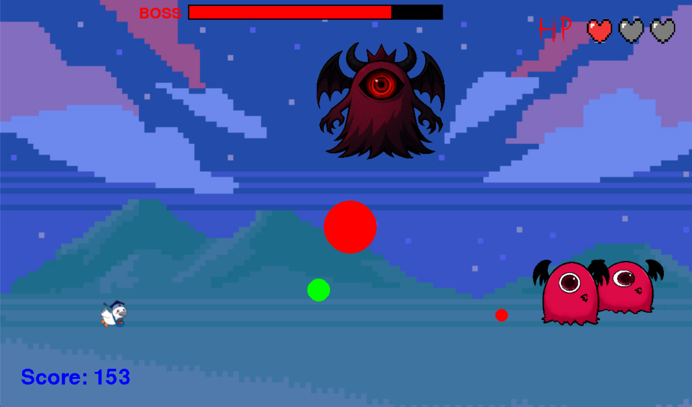

# ヒーローシューター

## 実行環境の必要条件
* python >= 3.10
* pygame >= 2.1

## ゲームの概要
* 主人公キャラクターを操作して敵を倒すゲーム

## ゲームの遊び方
* 左右矢印キーでキャラクターを移動、上矢印キーでジャンプできる
* スペースキーで攻撃、敵と爆弾を倒すとスコアを獲得。獲得したスコアが１００ポイントに達したら無敵化モードをエンターキーで発動可能。
* ボスを倒したら勝利。HPが0になったらゲームオーバー

## ゲームの実装

### 共通基本機能
* 背景画像と主人公キャラクターの描画
* 主人公キャラクターの描画
* 爆弾の描画
* 爆発の描画

### 分担追加機能
* 主人公のHP機能、HPバーの表示（担当：井上）：敵の弾があたったら、HPが一個消える
* スタート画面の表示、（担当：及川）：ゲームをスタートすると画面にスタート画面を表示させるプログラムを作成
* 敵機と自機の挙動変更、敵キャラのモデル変更（担当：手塚）：自機、敵機共に地面に接地。また、自機は上キーでジャンプ可能。
* ボス　（担当：小林）：一定時間経過後、警告演出（赤い画面）の後に背景が変わりボスが登場し、敵の出現が停止する。爆弾攻撃、炎柱攻撃、大砲攻撃の３つの攻撃方法がある。画面上部にはボスの体力を赤いバーで表示。
* 必殺技機能（担当：大淵）：一定時間無敵になる。無敵になっている間は点滅していて、爆弾にあたっても当たり判定がなくなる。
* ゲーム結果画面の表示(担当：魚住)：ゲームの結果に応じて、、いろいろ異なるメッセージを表示する機能

### ToDo
- 
- 

### メモ

* HP実装者または統合してくださるかたへ　resultクラスのイニシャライザでhpを受け取る部分があります。これを使ってGameover画面の表示を実装しています。リアルタイムのHP数値の代入お願いします。いつき
*
